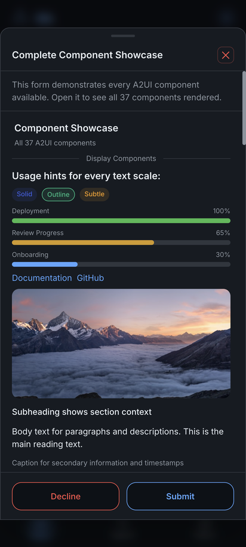
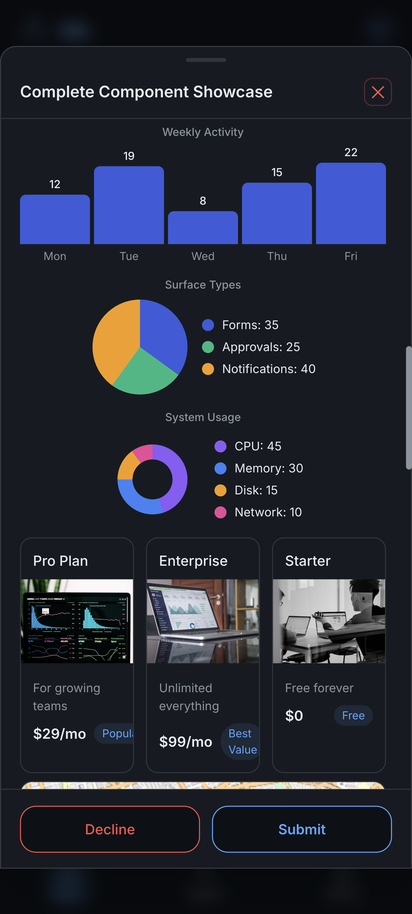
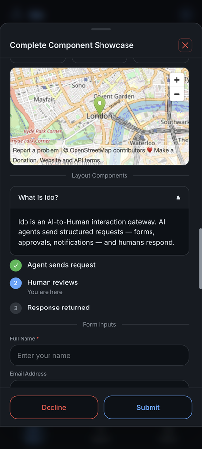
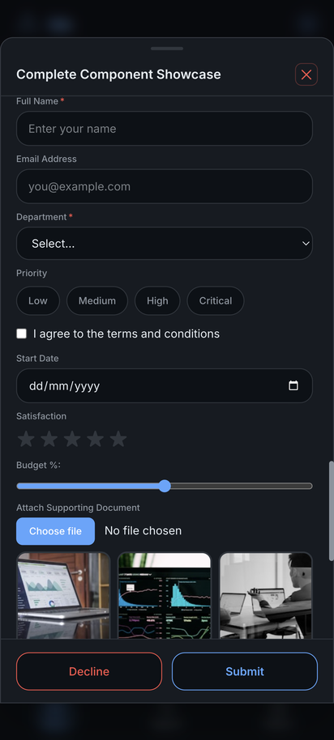
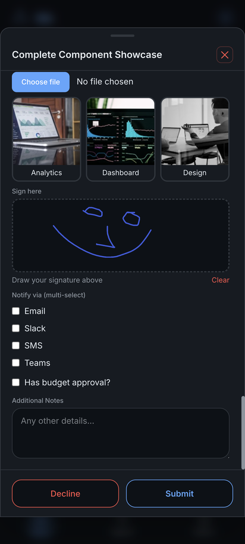
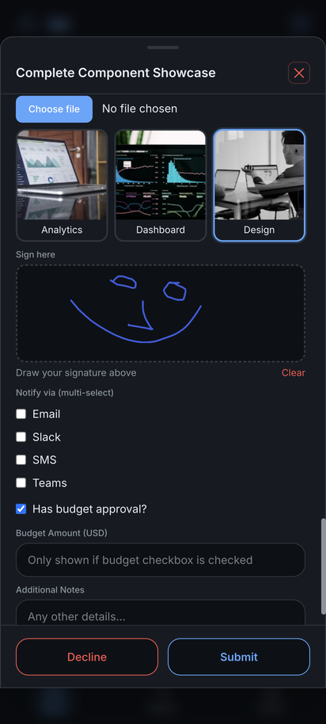

# Component Gallery

Every A2UI component Ido can render — all from a single declarative JSON payload sent by an AI agent.

## Animated walkthrough

Scroll through all 37 components, fill the form, and draw a signature.

---

## Display components

Text scales (heading, subheading, body, caption, label), solid/outline/subtle badges, progress bars, links, and images.

---

## Data components

Striped tables, data grids, line/bar/pie/donut charts, product pickers with image cards, and an interactive map.

---

## Layout components

Accordions and steppers for progressive disclosure and multi-step workflows.

---

## Form inputs

Text fields, email, number, selects, chip pickers, checkboxes, date pickers, star ratings, sliders, file uploads, image selects, signature pads, and conditional visibility — fields that appear only when a checkbox is ticked.

---

[← Back to README](../README.md)
