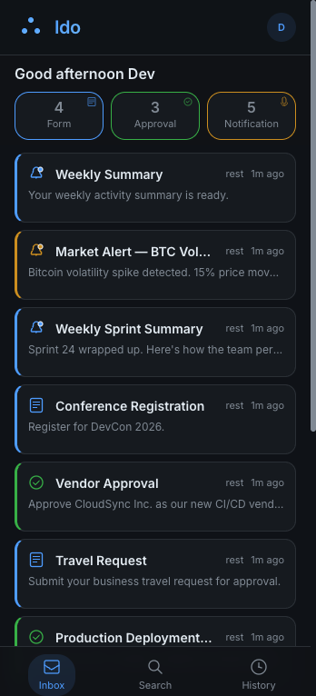
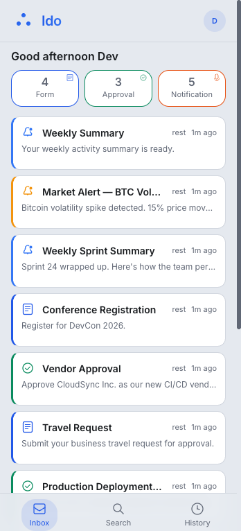
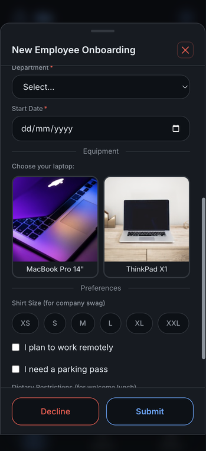
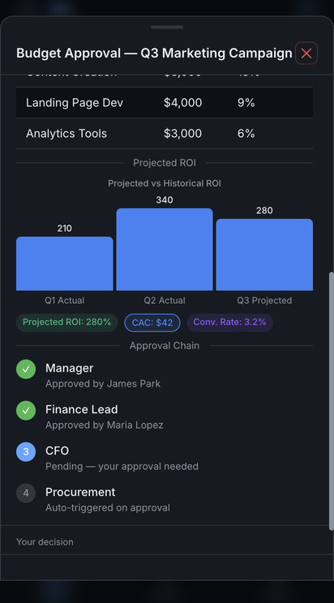
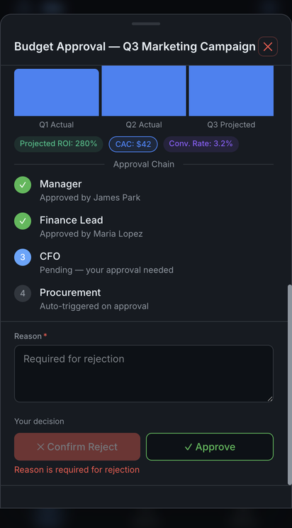
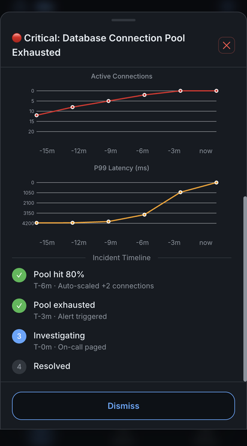

<div align="center">

# Ido

### AI-to-Human Interaction Gateway

Any AI agent, any protocol, can request a human decision and get a typed, validated response back — on any device, in any deployment model.

[](LICENSE)
[](https://github.com/prometheanleap/ido/actions/workflows/ci.yml)
[](https://nodejs.org)
[](https://www.typescriptlang.org)
[](https://react.dev)
[](https://hono.dev)

</div>

---

## What is Ido?

Ido is the **human-in-the-loop terminal** that sits between any AI system and any human. It is not a chat platform. It is not an agent builder. It lets AI agents send structured requests — forms, approvals, notifications — and reliably receive typed, validated responses.

- **Three protocols** — A2A (JSON-RPC), MCP (Model Context Protocol), and REST — all calling the same surface engine
- **Declarative UI** — forms, approvals, and notifications rendered from a component schema (A2UI)
- **Real-time delivery** — SSE streaming + Web Push notifications
- **Four deployment modes** — `dev`, `personal`, `saas`, `corporate` — one image, no code change
- **Dual database** — SQLite for development, PostgreSQL for production
- **PWA** — installable, offline-capable, push notifications on mobile
- **Multi-tenant** — tenant isolation built in, corporate user-scoping supported

---

<p align="center"></p>

## Screenshots

<table>
  <tr>
    <td align="center"><br/><sub>Inbox — dark</sub></td>
    <td align="center"><br/><sub>Inbox — light</sub></td>
    <td align="center"><br/><sub>Form — onboarding</sub></td>
  </tr>
  <tr>
    <td align="center"><br/><sub>Approval — context</sub></td>
    <td align="center"><br/><sub>Approval — reject</sub></td>
    <td align="center"><br/><sub>Notification</sub></td>
  </tr>
</table>

**Forms** — Agents describe the UI declaratively (A2UI) and Ido renders it: text, badges, charts, tables, maps, and every form input — no frontend code required. [Full gallery →](Docs/GALLERY.md)

**Approvals** — Rich context with embedded charts, tables, and multi-step chains. Reject can require a reason, so audit trails are always complete.

**Notifications** — Not just text. Live charts, severity badges, and incident timelines — everything the human needs to understand the situation at a glance.

---

## Quick Start

```bash
# Clone and install
git clone https://github.com/prometheanleap/ido.git && cd ido
cd proxy && npm install && cd ../ido-web && npm install && cd ..

# Configure
cp deploy.env.example .env
# Edit .env — set IDO_MODE, OIDC credentials, etc.
# (dev mode works out-of-the-box with no changes)

# Run
bash scripts/dev.sh
# Proxy: http://localhost:8645
# Web:   http://localhost:5173
```

Verify:

```bash
curl http://localhost:8645/api/v1/health
# {"status":"ok","mode":"dev","version":"..."}
```

That's it. In `dev` mode, you're auto-logged in as `dev`/`dev`. Start sending surfaces from any AI agent via A2A, MCP, or REST — they'll appear in your dashboard.

---

## Documentation

| Document | Covers |
|---|---|
| [Architecture](Docs/ARCHITECTURE.md) | Project structure, data flow, tech stack |
| [Configuration](Docs/CONFIGURATION.md) | Environment variables, deployment modes, OIDC setup |
| [API Reference](Docs/API.md) | A2A, MCP, and REST protocols; agent discovery; skills guide |
| [Component Gallery](Docs/GALLERY.md) | All 37 A2UI components with screenshots |
| [Deployment](Docs/DEPLOYMENT.md) | Docker, Google Cloud Run, deploy scripts |
| [Development](Docs/DEVELOPMENT.md) | Local setup, testing, database utilities |

---

## License

**Business Source License 1.1** (BUSL 1.1) — see [LICENSE](LICENSE).

Ido is source-available, not open source — and that's intentional. Here's why:

| Use case | License needed |
|---|---|
| Local development, testing, personal use | Free (BUSL) |
| Production SaaS or corporate deployment | [Commercial license](#) |
| After July 3, 2030 | MIT (automatic conversion) |

BUSL protects the project from cloud vendors offering Ido as a managed service without contributing back, while remaining free for the overwhelming majority of individual users and teams evaluating it. On the change date, it converts to MIT — permanently open source. This is the same model used by [Sentry](https://blog.sentry.io/why-we-license/), [CockroachDB](https://www.cockroachlabs.com/blog/oss-relicensing-cockroachdb/), and [MariaDB](https://mariadb.com/bsl-faq/).

For commercial licensing, contact the Licensor.

---

<div align="center">

**[Quick Start](#quick-start) · [API Reference](Docs/API.md) · [Changelog](CHANGELOG.md)**

</div>
